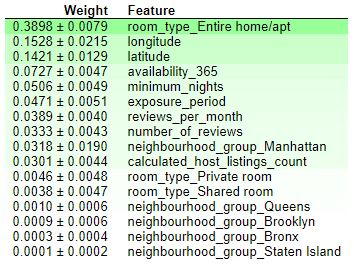

# Smart-pricing-airbnb-project

Final project for Data Science bootcamp organized by Sages (Kodołamacz).

The aim of this project is to analyze choosen dataset and create model for price prediction. Such a tool could be used in smart pricing algorithm for airbnb hosts. Potentially if you want to offer your apartment in Airbnb service, after entering information about the apartment, algorithm will suggest you what price is the most appropriate.

Used dataset: https://www.kaggle.com/dgomonov/new-york-city-airbnb-open-data.

In this project many models were tested and compared to achieve best results. You can see specific metrics below.

The best model for the R2_score and root mean square error is KNeighborsRegressor with tuned parameter. Using gridsearch optimal parameters was found ('metric': 'manhattan', 'n_neighbors': 20, 'weights': 'distance').
According to the best model weights, we can conclude that room type, longitude and latitude have the biggest influence to predicted price. It seems to be correct that location and room type have one of the bigest impact to airbnb price.

